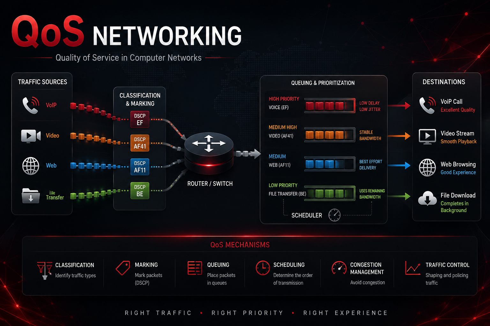
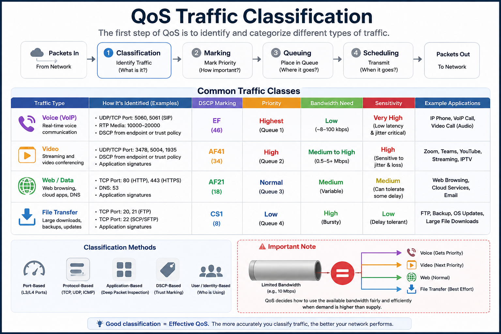
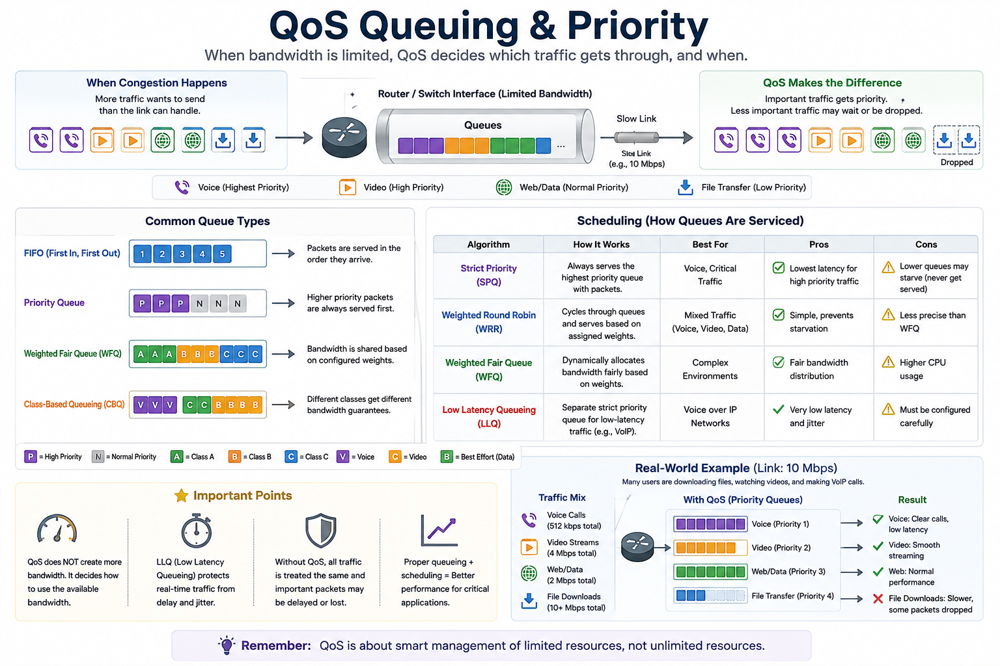
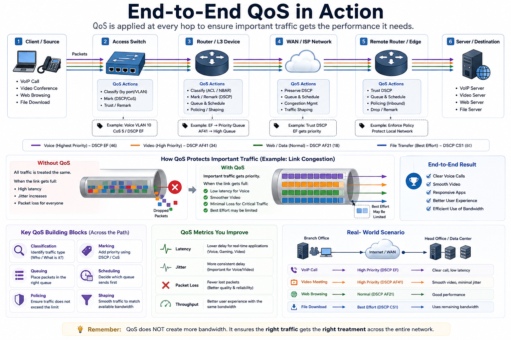

# QoS Networking

> A visual and practical guide to Quality of Service (QoS) in computer networks
> 

## Overview

Network traffic is not equally sensitive to latency, jitter, packet loss, or bandwidth limitations.

Quality of Service (QoS) provides mechanisms for identifying, classifying, prioritizing, and managing traffic when network resources are under contention.

This repository explains QoS through practical network diagrams, concepts, and real-world scenarios.

## QoS Overview

## Traffic Classification

QoS starts by identifying different types of network traffic and determining how each should be treated.

## Queuing & Priority

When network resources become congested, queuing and scheduling mechanisms determine how packets are transmitted.

## End-to-End QoS

QoS can be applied across multiple stages of a network, from traffic classification to marking, queuing, scheduling, shaping, and policing.

## Core Concepts

- Traffic Classification
- Traffic Marking
- DSCP
- Queuing
- Scheduling
- Priority Handling
- Congestion Management
- Traffic Shaping
- Traffic Policing
- Latency
- Jitter
- Packet Loss

## Real-World Traffic

| Traffic | Main Concern |
|---|---|
| VoIP | Latency, jitter, packet loss |
| Video | Bandwidth, latency |
| Web | Response time |
| File Transfer | Bandwidth |

## Documentation

- [QoS Fundamentals](docs/fundamentals.md)
- [Traffic Management](docs/traffic-management.md)
- [Real-World Examples](docs/real-world-examples.md)

## Important

QoS does not create additional bandwidth.

It manages available network resources so that important traffic can receive appropriate treatment during congestion.

## Goal

This project connects networking theory with practical traffic-flow scenarios to make QoS easier to understand.

---

**Networking • QoS • Traffic Engineering • Cybersecurity**
